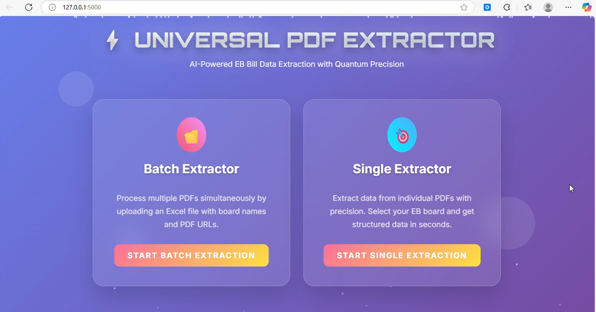
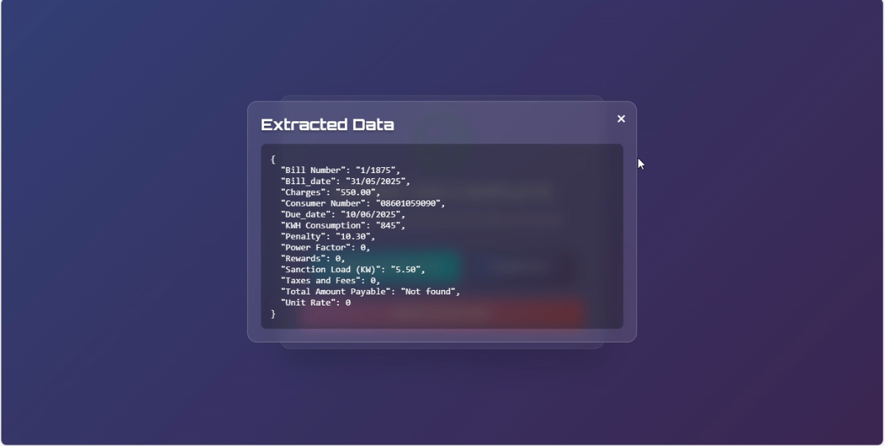

# ⚡ Universal Electricity Bill PDF Extractor

A scalable Python system that extracts structured data from electricity bill PDFs across **47 electricity providers in India**, with support for both **text-based and scanned (OCR) bills**.

---

## 🚀 Overview

Electricity bills vary significantly across providers, making automated extraction difficult.

This project solves that by combining:

* 🧩 Multi-provider parsing (47 providers)
* 📄 Direct PDF text extraction
* 👁️ OCR for scanned/image-based bills

👉 Converts unstructured electricity bills into clean, structured data ready for analysis or automation.

> 📂 Includes sample electricity bill PDFs for testing directly from the repository.

---


## 🔥 Key Highlights

* 🧩 Supports **47 electricity board providers**
* 📄 Works with both **text-based and scanned PDFs**
* 👁️ Integrated **OCR pipeline**
* ⚡ Modular extractor architecture (easy to extend)
* 🧠 Smart routing based on bill format
* 📊 Extracts detailed billing & consumption data
* 🏗️ Designed for real-world scalability

---
## 🎥 Demo

👉 [▶️ Watch Demo Video](https://youtu.be/NAvAN_Ekot4)

This demo shows:

* PDF input
* Automatic provider detection
* Structured output generation
* OCR handling for scanned bills

---
## 📸 Screenshots

### 🔹 Input / UI


### 🔹 Output

## 🏢 Supported Providers

Includes **47 providers**, such as:

* APCPDCL, APEPDCL, APSPDCL
* BESCOM, CHESCOM, GESCOM, HESCOM
* Adani, Ajmer, Jaipur
* Goa, KSEB, Jammu
* Dakshin Haryana, DGujrat
* ...and more

👉 Each provider has its own dedicated extractor:

```bash
Universal_extracter/extractors/
```

---

## 👁️ OCR Support (Scanned PDFs)

Some electricity bills are scanned images without selectable text.

This system handles them by:

1. Converting PDF → image
2. Extracting text using OCR
3. Applying parsing logic

> ⚠️ OCR accuracy depends on image clarity and document quality.

---

## 🛠️ Tech Stack

* Python
* PDF Processing Libraries
* OCR (Tesseract or similar)
* Regex / Rule-based Parsing
* Modular Architecture

---

## ⚙️ Installation

```bash
git clone https://github.com/patiluday3101/Universal_Extractor.git
cd Universal_Extractor
pip install -r requirements.txt
```

---

## 🚀 Usage

```bash
python app.py <path_to_pdf>
```

### Example

```bash
python app.py sample_bills/BESCOM_sample.pdf
```

---

## 📂 Sample Bills (Included)

Sample PDFs are available in:

```bash
sample_bills/
```

👉 Use them to quickly test extraction across different providers.

---

## 📦 Sample Output

```json
{
  "File Name": "temp.pdf",
  "Consumer Number": "110331038372",
  "Bill Number": "10019",
  "KWH Consumption": "574.00",
  "Sanction Load": "8.00",
  "Bill Date": "07-03-2025",
  "Due Date": "17-03-2025",
  "Amount Before Due Date": "9920",
  "Amount After Due Date": "10110",
  "Late Payment Surcharge": "190.00",
  "Current Bill Amount": "6399.03",
  "Previous Outstanding": "3521.00",
  "Power Factor": null,
  "Taxes and Fees": null,
  "Rewards": null,
  "Unit Rate": null
}
```

---

## 📊 Extracted Data Coverage

The system extracts multiple categories:

* 👤 Consumer Details
* ⚡ Electricity Usage
* 💰 Billing & Payment Breakdown
* 📅 Dates & Deadlines
* 📈 Financial Insights

---

## 📊 Accuracy & Performance

* ✅ ~80% overall accuracy across providers

### 📌 Accuracy Breakdown (Estimated)

* 🧾 **Text-based PDFs:** ~90%+ accuracy
* 🖼️ **Scanned PDFs (OCR):** ~70% accuracy

Accuracy is influenced by:

* Provider-specific layout variations
* Image quality in scanned PDFs
* OCR limitations

> 📊 Tested using sample bills included in this repository.

---

## 🧠 How It Works

1. Load PDF
2. Detect if text is extractable

   * ✅ Yes → Direct parsing
   * ❌ No → Apply OCR
3. Identify provider
4. Route to provider-specific extractor
5. Return structured data

---

## 🏗️ Project Structure

```bash
Universal_Extractor/
│── app.py
│── Universal_extracter/
│   ├── controller.py
│   ├── main.py
│   ├── extractors/
│   │   ├── APCPDCL.py
│   │   ├── BESCOM.py
│   │   ├── Adani.py
│   │   └── ... (47 providers)
│── sample_bills/
│── requirements.txt
│── README.md
```

---

## 🔮 Future Improvements

* 🤖 AI-based intelligent extraction (reduce regex dependency)
* 🌐 REST API for integration
* 📊 Export to CSV / Database
* 🧪 Unit tests per provider
* ⚡ Improved OCR accuracy

---

## 🤝 Contributing

Want to add support for a new provider?

1. Create a new extractor
2. Follow existing structure
3. Register in controller
4. Submit a pull request

---

## 📄 License

MIT License

---

## ⭐ Why This Project Stands Out

Most PDF extractors:
❌ Support limited formats
❌ Fail on scanned documents

This project:
✅ Supports **47 real-world providers**
✅ Handles both text and scanned PDFs
✅ Extracts **detailed financial + consumption data**
✅ Built with scalable architecture

👉 Can evolve into:

* Billing automation system
* Energy analytics platform
* SaaS product

---

## 👨‍💻 Author

**Uday Patil**
GitHub: https://github.com/patiluday3101

---
